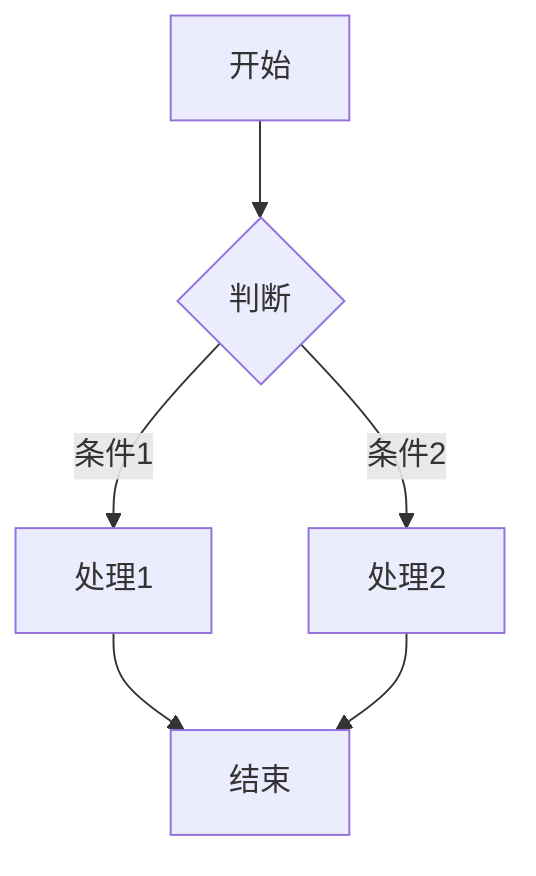

# Markdown 格式测试 ✨

:::callout 💡 提示
本工具已重构，现在能支持大部分 Markdown 格式，并适配微信公众号。
:::

---

## 文本样式演示

- **这是粗体** (Bold)
- *这是斜体* (Italic)
- ***这是粗斜体*** (Bold Italic)
- ~~这是删除线~~ (Strikethrough)
- <u>这是下划线</u> (Underline)
- ==这是高亮== (Highlight)
- `这是行内代码` (Inline Code)

### 链接与脚注
这是一个[外部链接](https://github.com)，它会被自动转换为文末脚注。

### 代码块测试
```python
def hello():
    print("Hello, WeChat!")
```

### 表格横向滑动测试
| 标题一 | 标题二 | 标题三 | 标题四 | 标题五 | 标题六 |
| :--- | :---: | ---: | :--- | :--- | :--- |
| 很长的内容 | 数据B | 100 | 更多内容 | 更多内容 | 更多内容 |


# Markdown 格式范本

> **用途**：本文件展示 Markdown 标准格式，可直接复制作为模板使用。
> 
> 版本：GitHub Flavored Markdown (GFM) 兼容

---

## 一、标题体系

# 一级标题 (H1) —— 文档/章节标题
## 二级标题 (H2) —— 主要章节
### 三级标题 (H3) —— 小节
#### 四级标题 (H4) —— 细分内容
##### 五级标题 (H5) —— 很少用到
###### 六级标题 (H6) —— 极限深度

---

## 二、段落与文本格式

这是普通段落。

这是独立段落，前后空行分隔。

### 2.1 强调样式

- *斜体* —— 单个星号或下划线：`*斜体*` 或 `_斜体_`
- **粗体** —— 双星号或下划线：`**粗体**` 或 `__粗体__`
- ***粗斜体*** —— 三星号： `***粗斜体***`
- ~~删除线~~ —— 双波浪线：`~~删除线~~`
- <u>下划线</u> —— HTML标签：`<u>下划线</u>`（非标准Markdown）
- ==高亮== —— 部分编辑器支持：`==高亮==`（GFM不支持，需插件）
- 行内代码 —— 反引号：`code`

### 2.2 特殊字符转义

星号转义：\*  反引号转义：\`  井号转义：\#  反斜杠本身：\\

---

## 三、列表体系

### 3.1 无序列表

- 项目一
- 项目二
  - 嵌套项目（缩进2空格）
  - 嵌套项目
    - 更深嵌套
- 项目三

* 也可以用星号
+ 或加号

### 3.2 有序列表

1. 第一步
2. 第二步
    1. 子步骤（缩进3空格）
    2. 子步骤
3. 第三步

### 3.3 任务列表（GFM扩展）

- [x] 已完成任务
- [ ] 未完成任务
  - [ ] 子任务A
  - [x] 子任务B

---

## 四、引用与注释

### 4.1 块引用

> 单行引用

> 多行引用
> 第二行继续
> 
> 空行后继续（同一段落）

> 嵌套引用
>> 第二层引用
>>> 第三层引用
> 
> 回到第一层

### 4.2 引用中的其他元素

> **引用中的粗体**
> 
> - 引用中的列表
> - 列表项二
> 
> `引用中的代码`

---

## 五、代码展示

### 5.1 行内代码

使用 `pip install` 命令安装。

### 5.2 代码块

```python
def hello_world():
    """带语法高亮的代码块"""
    print("Hello, World!")
    return True
```

```javascript
// JavaScript 示例
const greeting = (name) => {
    console.log(`Hello, ${name}!`);
};
```

```bash
# Bash 命令示例
echo "当前日期: $(date)"
ls -la | grep ".md"
```

```text
纯文本代码块（无语法高亮）
特殊字符无需转义：* # < >
```

---

## 六、链接体系

### 6.1 行内链接

- [普通链接](https://github.com)

---

## 七、图片与媒体

### 7.1 基础图片


---

## 八、表格（GFM扩展）

### 8.1 基础表格

| 表头1 | 表头2 | 表头3 |
|-------|-------|-------|
| 内容1 | 内容2 | 内容3 |
| 左对齐 | 居中 | 右对齐 |

### 表格内格式

| 功能 | 示例 |
|------|------|
| 粗体 | **重要** |
| 代码 | `inline` |
| 链接 | [GitHub](https://github.com) |
| 删除 | ~~废弃~~ |

---

## 九、分隔线与换行

### 9.1 水平分隔线

以下都是分隔线（至少3个字符）：

---

***

___


### 9.2 强制换行

使用 HTML：第一行<br>第二行

---

## 十、HTML 嵌入（GFM支持）

### 10.1 常用HTML标签

<details>
<summary>点击展开详情</summary>

折叠内容支持 **Markdown** 格式。

```python
print("甚至支持代码块")
```

</details>

### 10.2 其他实用标签

<mark>高亮文本</mark>（部分渲染器支持）

下标：H<sub>2</sub>O  
上标：x<sup>2</sup>

---

## 十一、扩展语法（非标准但常用）

### 图表（Mermaid，GFM实验性支持）



### 11.5 表情符号（Emoji）

使用直接输入：😀 ❤️ 👍 🚀

